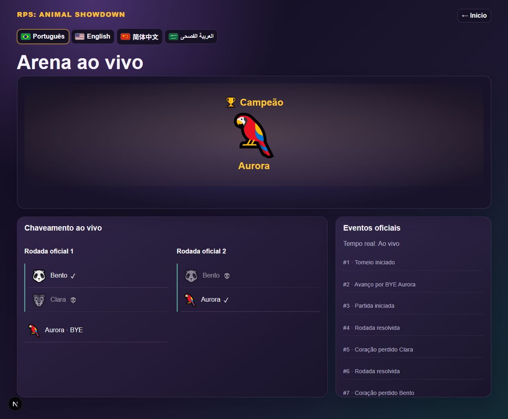

# Rodada 7 — relatório de implementação e QA

Data: 2026-10-05. Gate: **EXPERIÊNCIA DE ARENA COM AJUSTES**.

PASS indica o limite da evidência descrita, não aprovação implícita de uma
verificação mais abrangente. FAIL indica requisito ainda incompleto; NÃO TESTADO
indica ausência de comprovação. Não houve deploy, commit ou push nesta rodada.

## A. Estado inicial encontrado — PASS

A árvore já continha alterações não commitadas de rodadas anteriores, inclusive
runner competitivo PostgreSQL, estado público, Animal Rush e demonstração dos
seis status. Foram preservadas. Arena exibia diretamente o snapshot, sem timeline.
Os sons de animais eram perfis de osciladores, abriam um AudioContext por clique e
o alto-falante reproduzia esses tons. Não havia implementação de música na Arena.

Baseline: 101 passed/12 skipped em backend/Engine/realtime; 5/5 Animal Rush.
Os skips PostgreSQL foram eliminados na verificação final com banco dedicado.

## B. Arquitetura da apresentação — PASS

`presentation.mjs` converte eventos oficiais em etapas; `cinematic-arena.tsx`
executa essas etapas. `page.tsx` conserva o snapshot autoritativo e o transporte.
O componente não envia resultados, não sorteia jogadas nem executa Game Engine.
O estado transitório guarda etapa visual/partida apresentada; nunca altera o
snapshot oficial. O bracket e a lista de eventos acompanham o estado recebido,
podendo estar adiantados em relação à apresentação em reprodução.

## C. Timeline/fila — PASS, com limite de performance a acompanhar

Fila FIFO alimentada pelo consumidor WebSocket existente, que exige sequência
contígua e pede replay em lacunas. Há deduplicação adicional por ID/sequence.
Contagem/revelação são subetapas de um único round_resolved. Timers não bloqueiam
mensagens. A fila não corta eventos ao atingir 50 itens; 50 é apenas a janela do
log existente. O ledger completo continua no PostgreSQL.

Snapshot explícito estabelece piso de versão, cancela a etapa em andamento e
descarta eventos históricos já representados. Na reconexão, snapshot é carregado
ANTES de abrir o WebSocket para replay. Novo torneio reinicia o cursor visual.
Fila ao vivo pode acumular atraso a 0,5× se o servidor avançar mais rápido:
não foi realizado soak test de horas de empates. Não há limite artificial de empate.

## D. Entrada dos mascotes — PASS técnico / NÃO TESTADO polimento completo

`match_started` identifica os dois IDs oficiais. Web Animations mede posições
dos slots e dos mascotes na Arena, deslocando por dois segmentos até a chegada.
A próxima etapa só inicia após a duração da entrada. Prefers-reduced-motion
suprime o deslocamento. Não foram gravados quadros de todas as entradas possíveis
em torneios grandes; qualidade de coreografia ainda demanda inspeção humana.

## E. Velocidades — PASS automatizado

Durações divididas por 0,5/1/2/4/8 em testes, sem alterar payload ou resultado.
Movimento e contagem usam suas opções independentes. Browser: torneios reais a
1× e 0,5×. NÃO TESTADO: E2E visual separado a 2×, 4× e 8×.

## F. Contagem — PASS

Três etapas 3,2,1, cada uma de 650ms/velocidade da contagem. Revelação posterior.
Cue sonoro de contagem condicionado a efeitos. Número observado no navegador.

## G. RPS — PASS

Revela playerOneMove/playerTwoMove oficiais. Nenhum RNG competitivo foi introduzido.
O estado anterior anexado somente à fila local evita antecipar a perda de coração
ao recuperar uma partida cujo próximo resultado já chegou. Log persistido do
browser não serializa essa cópia de apresentação.

## H. Corações — PASS

`heart_lost` apresenta coração quebrado e usa heartsRemaining oficial.
Não subtrai vidas por inferência de jogadas. Eliminação vem de evento oficial.
Reconciliação retorna ao snapshot, cancelando animações antigas.

## I. Vitória — PASS

Resultado da rodada identifica vencedor a partir do perdedor oficial, sem aplicar
tabela RPS local. Vitória da partida usa `match_completed`, destaque e cue próprio.
Mensagens diferenciam rodada e partida.

## J. Eliminação — PASS

`player_eliminated` dessatura o mascote. O bracket conserva derrotado com caveira,
nome e slot original. Observados Clara e Bento eliminados no primeiro torneio.

## K. Avanço — PASS técnico / NÃO TESTADO todos os caminhos

`player_advanced` desloca da Arena para o próximo slot conhecido. Quando não há
próximo slot, usa uma área visual de espera com trilho tracejado. Não inventa
confronto nem altera o bracket. Movimento usa ID de participante, permitindo
mascotes repetidos. Precisa inspeção estética de brackets grandes e scrollados.

## L. BYE — PASS

Evento `bye` produz etapa de avanço, sem contagem, batalha ou efeitos extras.
Nos testes reais Aurora e Fábio receberam BYE oficial. O slot permanece identificado.

## M. Bracket — PASS

Usa current_round/completed_rounds do servidor. Colunas roláveis no celular,
vencedores e derrotados preservados. Nunca determina pares localmente.

## N. Event log — PASS

Mantém ID e sequência; acrescenta nome de playerId/winnerId quando disponível.
Reconexão demonstrou 41 linhas com 41 IDs distintos. Janela visual de 50 eventos
mantida do projeto. Não foi adicionada paginação de todo o ledger.

## O. Gerenciador de áudio — PASS automatizado

`audio-manager.mjs`: contexto único, canais music/arena/animal e speechSynthesis
separado. Seleção interrompe animal anterior; narração interrompe animal e fala
anterior. Navegação/unmount encerra timers, fontes e fala. Retoma contexto por
gesto de pointer/teclado; restrições de autoplay do navegador permanecem válidas.

## P. Efeitos — PASS automatizado / NÃO TESTADO escuta humana

Whitelist: contagem, heart_lost, player_eliminated, victory e champion. Não há
cue separado para revelação ou empate. Testes garantem efeitos OFF. Não foi
capturada nem auditada a saída física de áudio do dispositivo.

## Q. Música — PASS automatizado / NÃO TESTADO escuta humana

Motivo sintetizado original de quatro notas com loop único e volume discreto.
Não reinicia por render; muda notas no campeão; encerra ao navegar. Quatro
combinações testadas independentemente. Dois torneios reais usaram ON/ON e
OFF/ON. ON/OFF e OFF/OFF foram validados por testes, não por escuta no browser.

## R. Sons dos animais — FAIL como áudio definitivo

Clique no mapa seleciona e executa perfil, com interrupção do anterior. Os 26
perfis preexistentes são placeholders sintetizados, NÃO gravações características
comprovadas. Falta curadoria de sons reais compatíveis com licença por espécie.
Não confundir sucesso técnico do canal com fidelidade zoológica.

## S. TTS/narração — PASS técnico / NÃO TESTADO pronúncia

Alto-falante exclusivamente narra nome comum localizado e nome científico.
stopPropagation não seleciona nem navega. Testes cobrem locales, falta de voz,
ausência de API e interrupção. No browser foram clicados os quatro idiomas sem
mudar o Tigre selecionado; Panthera tigris permaneceu igual. Qualidade das vozes
PT/EN/ZH/AR e pronúncia científica não foram auditadas por escuta.

## T. Taxonomia — PASS preservação / NÃO TESTADO revisão científica

Nenhum nome científico foi alterado. Espécies adotadas anteriormente para emojis
amplos permanecem no catálogo. Não foram criadas alegações de símbolo nacional.
Revisão científica independente dessas escolhas segue pendente.

## U. Assets/licenças — PASS para código / FAIL sons definitivos

Não há hotlinks nem downloads de áudio de terceiros. Síntese original no código.
Pendências e critérios de licença em [round-7-audio-assets.md](round-7-audio-assets.md).

## V. Campeão — PASS

Campeão só vem do evento/snapshot oficial. Banner, nome, mascote, bracket final,
celebração visual, efeito e variação musical implementados. Torneio
`RPS-D8WBEWHB8AP6735A`: Aurora campeã, 30 eventos. Segundo torneio
`RPS-7T8XRF7KYEDYKG7U`: Fábio campeão, snapshot versão 20, 41 eventos.

## W. Animal Rush — PASS

Cinco testes originais intactos. Clara entrou READY, abriu Animal Rush, recebeu
Start oficial e foi redirecionada para Arena. Timers locais cancelados pelo
fluxo existente. Minigame não participa de nenhum resultado oficial.

## X. Treinar livre — PASS

Fluxo manual Home → Treinar → Panda → treinador → 2 vidas → estratégia → treino
executado. Jogada Pedra produziu rodada 1 Pedra VS Pedra com corações intactos.
Sem erro de console nessa sessão. Código das regras de treino preservado.

## Y. Idiomas/RTL — PASS interface; narração audível NÃO TESTADA

Novas mensagens no catálogo central nos quatro idiomas. Troca PT/EN/ZH/AR
executada na seleção. `main dir=rtl` confirmado para árabe. Nome científico canônico.

## Z. Responsividade — PASS nos tamanhos testados

360×800: encontrado overflow horizontal do seletor de idiomas preexistente.
Corrigido com redução conservadora apenas até 480px, mantendo quatro opções.
Depois: clientWidth/scrollWidth 345/345 (360), 375/375 (390), 1265/1265 (1280),
1905/1905 (1920). Bracket tem scroll próprio. Desktop e campeão mobile inspecionados.
TV/projetor físicos NÃO TESTADOS; viewport largo não equivale a teste de projeção.

## AA. Performance — PASS limpeza; carga prolongada NÃO TESTADA

Transform/opacity, Web Animations nativa, nenhuma biblioteca pesada adicionada.
Uma fila por página; um timer executor e um timer musical. Cleanup de animações,
timer e canais. IDs visuais retidos em conjunto limitado de 512; log em 50.
Fila pendente mantém os eventos ao vivo; analisar consumo/atraso em longas sessões.

## AB. Realtime/replay/reconnect — PASS no cenário executado

Na segunda partida, página foi navegada para about:blank durante apresentação,
encerrando a conexão do participante. O backend continuou até campeão. Retorno
restaurou snapshot final imediatamente, com 41 IDs únicos e zero contagens antigas.
Não houve erro no console. Isso testa encerramento/restauração da página;
queda de pacote intermitente sem unload NÃO TESTADA manualmente.
Suíte PostgreSQL/realtime cobre tickets, replay e isolamento de salas.

## AC. Segurança/regressões — PASS nos testes existentes

Mudança backend limitada à exposição de flags de áudio e velocidades já públicas
na configuração; teste valida as quatro combinações. Whitelist de estado continua
excluindo estratégias e condições privadas. Engine, rate limits, autenticação,
ledger, schema e resultado não foram alterados nesta rodada.
Não foi executada auditoria externa ou revisão independente de segurança.

## AD. Testes automatizados — PASS

- `npm run lint` em apps/frontend: exit 0.
- `npm test`: 23 passed, 0 failed, 0 skipped (inclui 5 Animal Rush).
- `npm run build`: exit 0; inclui verificação TypeScript.
- `python -m pytest apps/backend/tests realtime/tests packages/game-engine/tests database/migrations/tests -q`
  com RPS_TEST_DATABASE_URL dedicado: 130 passed, 0 failed, 0 skipped.
- Avisos existentes: 48 avisos de depreciação FastAPI on_event/lifespan.
- `git diff --check`: exit 0; avisos de normalização LF/CRLF, não erros.

Banco `rps_round7_qa` exclusivo foi criado no PostgreSQL isolado. Algumas fixtures
truncam tabelas; por isso não usaram `rps_status_demo` nem o banco do ambiente normal.

## AE. Testes manuais — PASS parcial

Concluídos: seleção rápida, alto-falante nos quatro idiomas sem mudança da seleção,
READY, espera, Animal Rush → Arena, torneio até campeão, BYE, empate, eliminação,
reconexão com backend avançando, treino livre e tamanhos acima. Console vazio de
erros nas sessões inspecionadas. Fluxos HTTP funcionaram; captura completa de
tráfego de network e auditoria de arquivos de áudio NÃO TESTADAS.
Velocidades visuais 2/4/8× e escuta física dos quatro modos continuam pendentes.

## AF. Git — PASS preservação

Árvore inicialmente suja e mantida assim para revisão. Novos arquivos desta rodada:
`presentation.mjs`, `presentation.test.mjs`, `audio-manager.mjs`,
`cinematic-arena.tsx`, estes relatórios e evidência. Arquivos integrados: page.tsx,
styles.css, catalog.ts, package.json, public_state.py e test_public_state.py.
Os dois últimos já eram untracked no início; não foram criados do zero nesta rodada.
Sem commits, push, reset, exclusão de dados ou deploy público.

## AG. Pendências

1. Substituir os 26 perfis por sons característicos legitimamente licenciados ou
   estabelecer, com o proprietário, quais animais devem permanecer sem vocalização.
2. Escuta humana de música/efeitos/TTS e vozes nos quatro idiomas.
3. E2E visual adicional a 2×/4×/8×, quatro combinações sonoras por escuta,
   perda de rede sem unload e soak test de longas sequências de empate.
4. Inspeção estética de todos os trajetos em brackets maiores, inclusive slots fora
   da área rolada. O deslocamento atual usa coordenadas de elementos DOM e trilho simples.
5. Revisão taxonômica das espécies já adotadas e teste em TV/projetor físico.

Essas pendências não impedem usar o torneio local, mas impedem aprovar integralmente
a experiência audiovisual exigida pelo gate.

## AH. Gate

**EXPERIÊNCIA DE ARENA COM AJUSTES**.

A camada de apresentação, música/efeitos independentes, narração, reconciliação e
fluxos preservados têm implementação e evidência. Não declarar experiência aprovada
enquanto sons reais e verificações audíveis/visuais restantes não forem concluídos.

